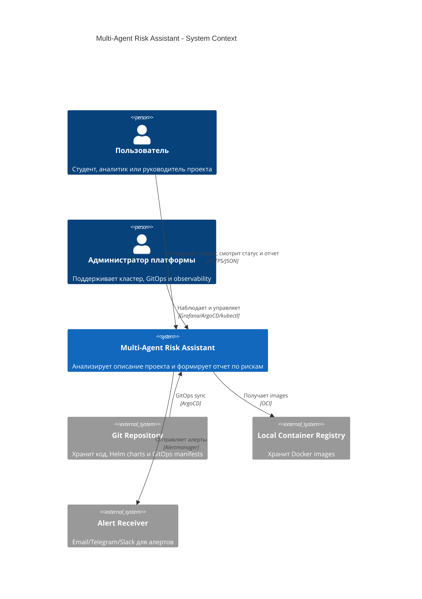
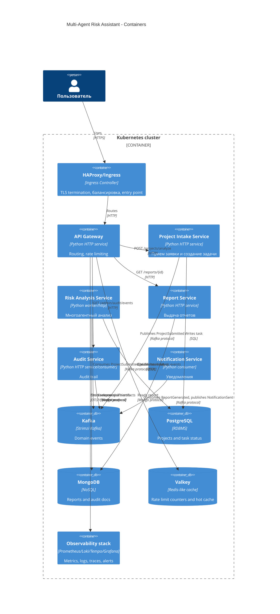
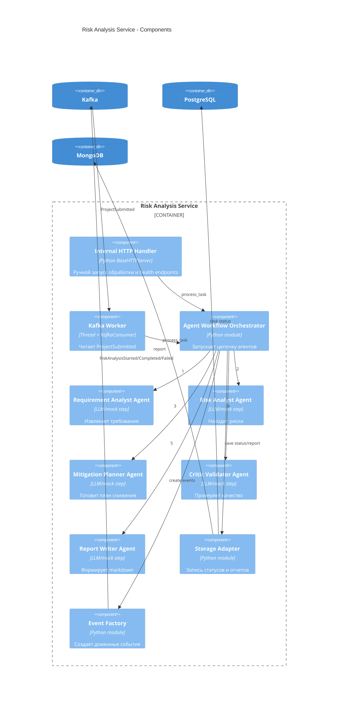
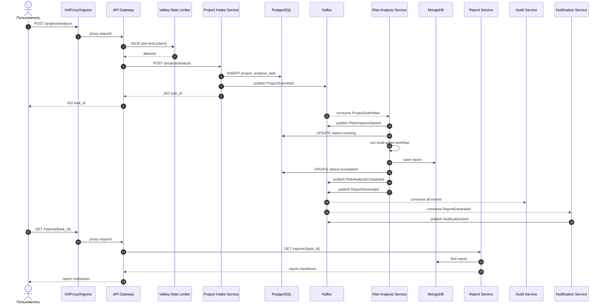
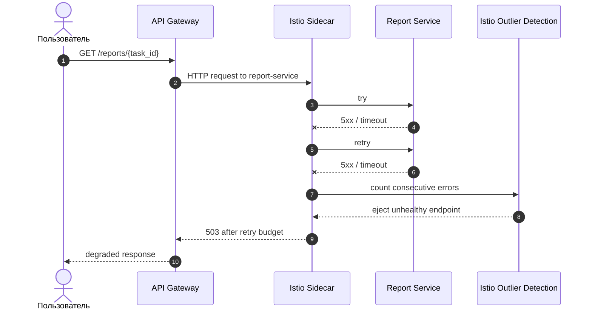

# C4 и Sequence Diagram

Диаграммы написаны в Mermaid, чтобы их можно было вставить в README, GitLab/GitHub Wiki или отчет.

## C4 L1 - System Context

## C4 L2 - Container Diagram

## C4 L3 - Component Diagram для Risk Analysis Service

## Sequence Diagram - успешный анализ

## Sequence Diagram - circuit breaker при отказе Report Service

